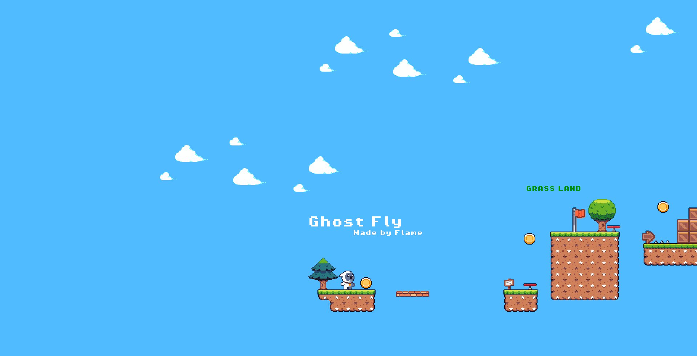

# Ghost Fly

---

##  English Version

## ✨ About

> Ghost Fly is a game made with the *Godot Engine*. You need to control a little ghost that goes through different scenarios. Among the existing scenarios are Grass Land, Winter Land, and Tropic Land.
> Your goal is to reach the end of these scenarios. There will be several obstacles to overcome, several coins to collect, and, in the end, you must reach the red crown, which is the objective of the game. After that, a "END" message appears and the program is automatically closed.
> The *resources* (*assets*, *images* and *songs*) of this game is completely free and you can found it in places like [Kenney](https://kenney.nl/assets), [Itch](https://itch.io/game-assets/free), [Opengameart](https://opengameart.org/), [Craftpix](https://craftpix.net/), and others.



> This game is a dream for me, and I've been planning it since 2023. That year, I knew nothing about programming, not even HTML; I'd never worked with anything like that before. But in late 2024 and early 2025, I started seriously studying programming, and soon after that, in July 2025, I created this game.

## 🚀 Download

> You can download it in the `builds` folder and execute the `Ghost Fly.exe`. It is only available in the *Windows*.
> You can confirm the *SHA-256* of the executable:

`025719CCCCB20CFBC1777B01AC2C394F8A04D3ECAA3EC2DAC3861029F6C5F5EB`

```powershell
Get-FileHash ".\Ghost Fly.exe" -Algorithm SHA256
```

> If the hash is exact with the above, you can play it safely 🔥!

## 🐛 Issues

> Did you find a *error* or a *bug*? Please, [open a new issue](https://github.com/flameastro/Ghost-Fly/issues) or go to *https://github.com/flameastro/Ghost-Fly/issues*.

---

##  Versão em Português

## ✨ Sobre

> **Ghost Fly** é um jogo feito com a *Godot Engine*. Você precisa controlar um pequeno fantasma que passa por diferentes cenários. Entre os cenários existentes estão **Grass Land**, **Winter Land** e **Tropic Land**.
> Seu objetivo é chegar ao final desses cenários. Haverá vários obstáculos para superar, várias moedas para coletar e, no final, você deve alcançar a **coroa vermelha**, que é o objetivo do jogo. Depois disso, uma mensagem de **"END"** aparece e o programa é fechado automaticamente.
> Os *recursos* (*assets*, *imagens* e *músicas*) deste jogo são completamente **gratuitos** e podem ser encontrados em lugares como [Kenney](https://kenney.nl/assets), [Itch](https://itch.io/game-assets/free), [Opengameart](https://opengameart.org/), [Craftpix](https://craftpix.net/) e outros.x


> Este jogo é um sonho para mim, e venho planejando desde 2023. Naquele ano eu **não sabia nada de programação**, nem mesmo HTML; nunca tinha trabalhado com nada parecido antes.
> Mas no final de 2024 e início de 2025, comecei a estudar programação seriamente e, pouco tempo depois, em **julho de 2025**, criei este jogo.

## 🚀 Download

> Você pode fazer o download na pasta `builds` e executar o arquivo `Ghost Fly.exe`.
> Atualmente, ele está disponível **apenas para Windows**.
> Você pode confirmar o *SHA-256* do executável:

`025719CCCCB20CFBC1777B01AC2C394F8A04D3ECAA3EC2DAC3861029F6C5F5EB`

```powershell
Get-FileHash ".\Ghost Fly.exe" -Algorithm SHA256
```

> Se o hash for **exatamente igual** ao mostrado acima, você pode jogar com segurança 🔥!

## 🐛 Problemas / Bugs

> Encontrou algum *erro* ou *bug*?
> Por favor, [abra uma nova issue](https://github.com/flameastro/Ghost-Fly/issues) ou acesse:
> **[https://github.com/flameastro/Ghost-Fly/issues](https://github.com/flameastro/Ghost-Fly/issues)**
