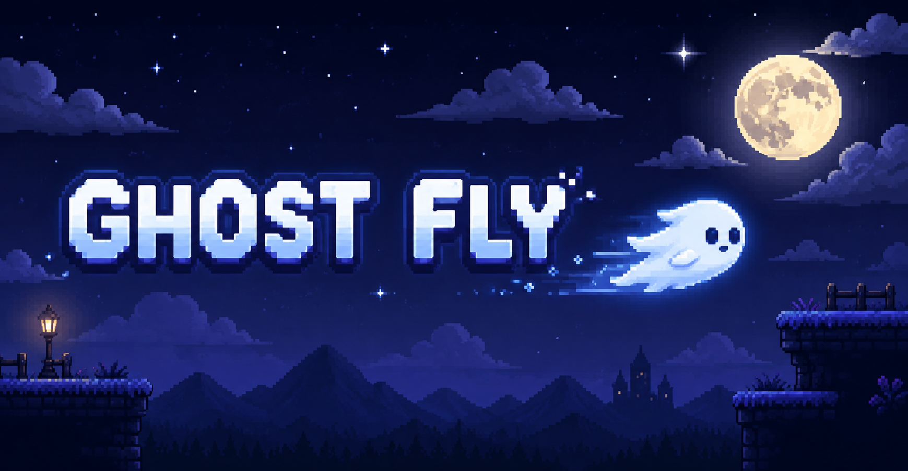

# Ghost Fly

    

Ghost Fly is a game made with the *Godot Engine*. You need to control a little ghost that goes through different scenarios. Among the existing scenarios are **Grass Land**, **Winter Land**, and **Tropic Land**.

Your goal is to reach the end of these scenarios. There will be several obstacles to overcome, several coins to collect, and, in the end, you must reach the red crown, which is the objective of the game. After that, a "END" message appears and the program is automatically closed.

The *resources* (*assets*, *images* and *songs*) of this game is completely free and you can found it in places like [Kenney](https://kenney.nl/assets), [Itch](https://itch.io/game-assets/free), [Opengameart](https://opengameart.org/), [Craftpix](https://craftpix.net/), and others.

The game is also available in [Itch.io](https://flameastro.itch.io/ghost-fly).

    

This game is a dream for me, and I've been planning it since 2023. That year, I knew nothing about programming, not even HTML; I'd never worked with anything like that before. But in late 2024 and early 2025, I started seriously studying programming, and soon after that, in July 2025, I created this game.

## 🚀 Download

You can download it in the `builds` folder and execute the `Ghost Fly.exe`. It is only available in the *Windows*.
⚠️ Windows may show a security warning when opening the game.
If you downloaded Ghost Fly from this page, choose “More info” → “Run anyway” if Windows asks for confirmation.

## 🐛 Issues

Did you find a *error* or a *bug*? Please, [open a new issue](https://github.com/flameastro/Ghost-Fly/issues) or go to *https://github.com/flameastro/Ghost-Fly/issues*.
